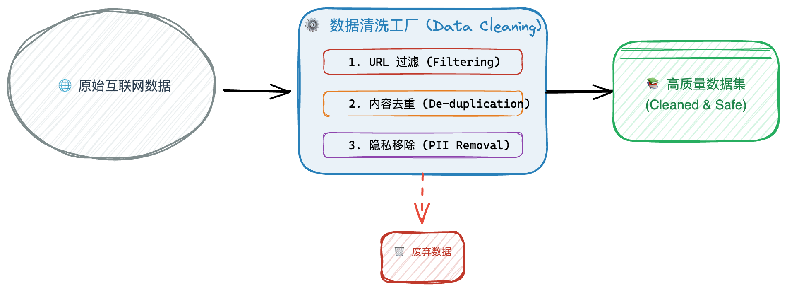
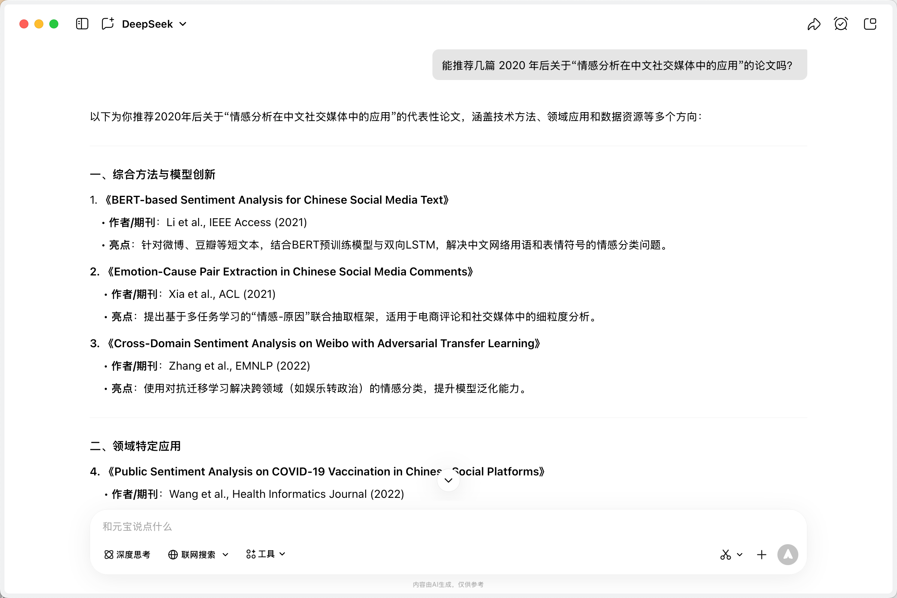
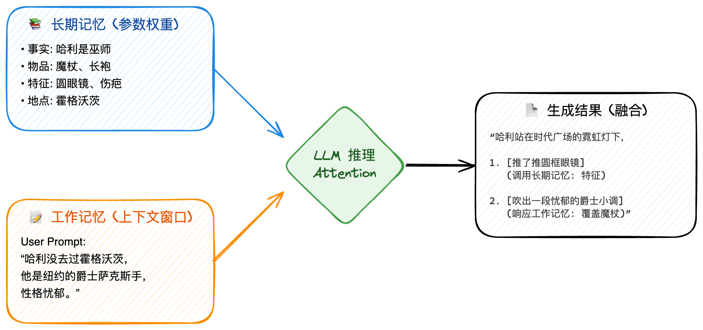
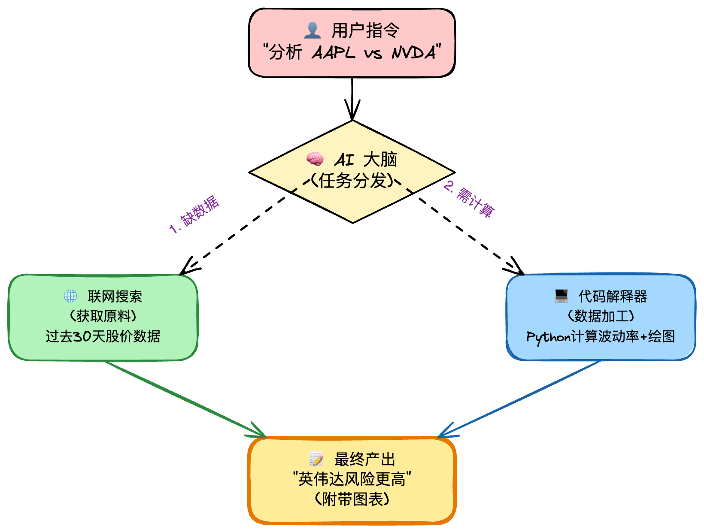
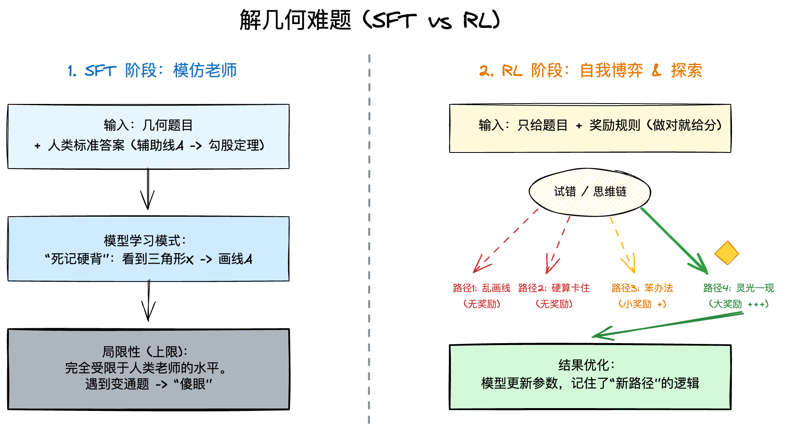

# 什么是大语言模型

## 引言

当你在 Google 搜索框输入几个字时，下方会自动弹出一串相关的搜索推荐。这个功能背后其实也运用了语言模型技术——它通过统计海量用户的搜索历史，预测并补全最可能的查询词。虽然它的规模和能力远不如现在的大语言模型（如GPT），但背后的‘基于上下文预测序列’的思路是相通的。

这是一篇专为零基础读者定制的深度科普。 为了让你轻松理解“大语言模型”背后的复杂逻辑，我们避开了晦涩的数学公式，转而使用了一些例子,看它如何从只会“文字接龙”的复读机进化为具备推理能力的智能助手；同时，我们也会深入剖析它的“记忆机制”与“幻觉”缺陷，让你不仅会用 AI，更懂它“大脑”的运作原理。


### LLM的基本定义
简单来说，大语言模型就是一个阅读了互联网上几乎所有文本、拥有亿级参数的“超级自动补全系统”。但它并不是在“思考”，而是在“预测”。它通过计算概率，猜测下一个最可能出现的字是什么。

但这只是冰山一角。要真正理解ChatGPT、Claude或DeepSeek背后的魔法，我们需要拆解它们是如何被构建出来的，以及它们在设计上既包含了极为复杂和精巧的机制，也存在明显的缺陷和局限性的大脑结构是如何运作的。

---

## LLM 的本质

### 概率统计工具
- 大语言模型是一个概率统计工具。
- 它既强大又有明显的缺陷。

---

## 全流程预览

### LLM训练的三个关键阶段
- 大模型训练的三个关键阶段：
  1. 预训练
  2. 监督微调
  3. 强化学习

---

## 第一阶段：预训练 (Pre-training)

### 大数据收集与过滤
大语言模型的第一阶段是预训练。这一阶段通常从互联网上大规模下载数据集，比如 FineWeb 或 Common Crawl 等，这些数据集包含了丰富而多样化的文本信息。为了保证数据质量，工程师们会对原始数据进行严格的清洗，比如进行 URL 过滤、去重、移除个人隐私信息（PII）等处理，剔除可能影响模型训练效果的不良内容。



### 分词机制与输入转换
在数据准备好后，模型会通过一种叫作“分词（Tokenization）”的核心机制，对文本进行处理。对于大模型来说，它“看到”的并不是具体的汉字、字母或者标点，而是一串又一串对应词表中整数 ID 的 Token。分词策略决定了词表的大小和模型每次输入的序列长度之间的权衡，关系到效率与表达能力。

假设我们要让大模型处理这句话：

> **“学习AI很有趣”**

在模型眼中，这句话并不是由汉字和字母组成的，而是经历了以下三个阶段的转化：

#### 第一步：切分 (Tokenization)

分词器（Tokenizer）会将这句话切分成一个个独立的单位（Token）。

*注意：现在的分词策略（如 BPE 算法）通常不会简单地按字切分，而是会将常见的词组或经常出现的字符组合合并为一个 Token，以此提高效率。*

**切分结果（示例）：**

```
["学习", "AI", "很", "有趣"]
```

- **“学习”**：这是一个常用词，在词表中作为一个整体存在。
- **“AI”**：英文缩写，通常也被作为一个整体。
- **“很”**：单字 Token。
- **“有趣”**：常用形容词，作为一个整体。

------

#### 第二步：映射 (Mapping to IDs)

模型无法直接理解“学习”这个词，它需要去查阅它的“词表（Vocabulary）”。词表就像一本巨大的字典，每一个 Token 都在这本字典里有一个唯一的编号（Index/ID）。

假设模型的词表如下（简化版）：

| **Token** | **整数 ID** |
| --------- | ----------- |
| ...       | ...         |
| 学习      | **8321**    |
| AI        | **156**     |
| 很        | **290**     |
| 有趣      | **4421**    |
| ...       | ...         |

------

#### 第三步：输入模型 (Input IDs)

最终，大模型实际接收到的“输入”，既不是汉字，也不是拼音，而是一串纯数字向量：

$$[8321, 156, 290, 4421]$$

### 神经网络拟合与损失最小化
模型训练的核心过程，实际上就是通过深度神经网络不断预测下一个最有可能出现的 Token。本质上，神经网络就是一个庞大的数学表达式，通过不断地计算和调整参数，它试图让自己对下一个 Token 的预测误差（Loss）最小化。这一个训练过程需要用到大规模的 GPU 集群，消耗巨大的算力和成本。


### 预训练产物：基座模型
经过漫长复杂的训练，第一阶段的结果就是诞生了基座模型（Base Model）。这个模型就像一个“互联网文档模拟器”或“梦呓者”：它可以基于已有文本不断地续写，但还不能直接理解和精准回答问题。例如，当你问它“2+2=”，它往往会续写成一段类似试题说明的文本，而不会直接给出答案“4”。

---

## 第二阶段：监督微调 (Post-training / SFT)

### 训练目标转变：从续写到“助手”
在第二阶段，也就是监督微调（SFT）阶段，大语言模型的训练目标发生了转变：它不再只是简单地续写文本，而是被塑造成可以辅助人类的“助手”。为此，训练所用的数据也由之前的大规模互联网原始文本，变成了精心挑选的高质量对话数据，这些数据通常包括问题（Prompt）与理想回答（Ideal Response）的配对。这个阶段依赖人工标注，专家会为模型编写各种提示词以及相应的理想回答，从而让模型学习如何更好地理解和响应人类请求。此外，为了让模型具备多轮对话的能力，工程师还会引入一些特殊的 Token（如 `<|im_start|>`），用于标记每一轮对话的起始点。

### 模仿学习：对话能力的形成
本质上，经过这一阶段的训练，我们和模型的互动，实际上是与所有标注员“平均风格”的对话。大模型通过模仿学习（Imitation Learning），掌握了作为人类助手的行为准则，能够更自然地理解问题并给出有帮助的回答。

---

**1. 预训练 vs. SFT：有什么区别？**

**A. 预训练阶段（Raw Text）**

在预训练阶段，模型看到的都是互联网公开的原始文章。这个阶段的核心是“接龙”——模型只需要预测下一个词应该是什么。

- 示例文本：  
  ...光合作用是植物生长的重要过程。（模型预测下一个词） → 它通常发生在叶绿体中，利用光能将二氧化碳和水转化为葡萄糖...

- 模型视角：  
  *我只是在续写百科全书内容，不知道这是不是在回答问题，也没有“你”和“我”的概念。*

**B. SFT 阶段（对话格式）**

到了监督微调（SFT）阶段，数据变成专家设计的对话样本。每条数据被特殊标记包裹，结构更加清晰。

**用户看到的对话示例：**

- Prompt（用户）：  
  请简要解释一下光合作用，就像我是个小学生一样。

- Ideal Response（理想回答）：  
  好的！光合作用就像是植物在“做饭”。植物利用阳光作为能源，把空气中的二氧化碳和土壤里的水，变成了给自己补充能量的糖分，同时还会释放出我们呼吸的氧气。

---

**2. 模型内部看到的数据是什么样？（含特殊 Token）**

工程师会把上面的对话转换成带有特殊 Token 格式的字符串，帮助模型区分谁在说话，以及什么时候该开始/结束。

常见的标记格式（如 ChatML）如下所示：

```
<|im_start|>user
请简要解释一下光合作用，就像我是个小学生一样。<|im_end|>
<|im_start|>assistant
好的！光合作用就像是植物在“做饭”......（省略）...释放出我们呼吸的氧气。<|im_end|>
```

**关键组成部分说明：**

- `<|im_start|>user`：起跑信号。提示模型接下来是“用户提问”。
- `<|im_end|>`：结束信号。告知“用户/助手说完了”。
- `<|im_start|>assistant`：助手轮到发言。“你（助手）”该作出回答了，要求有帮助、真诚且无害。

通过这些标记，模型学会了何时开始、何时结束以及自己应该以什么身份输出内容。

---

**3. 多轮对话的进阶示例**

如果用户继续追问：“那这个过程需要什么条件？”，工程师会把整个对话历史拼接成一个长序列：

```
<|im_start|>user
请简要解释一下光合作用，就像我是个小学生一样。<|im_end|>
<|im_start|>assistant
好的！光合作用就像是植物在“做饭”...（省略）...释放出我们呼吸的氧气。<|im_end|>
<|im_start|>user
那这个过程需要什么条件？<|im_end|>
<|im_start|>assistant
主要需要三个条件：阳光（提供能量）、水（来自土壤）和二氧化碳（来自空气）。<|im_end|>
```

SFT（监督微调）的核心，是让模型每次都完整地“阅读”带有历史的全部对话序列，而不是靠记忆。这样，模型才能在 `<|im_start|>assistant` 后准确预测出专家写的理想回答。


---

## 第三阶段：大模型心理学 (LLM Psychology) —— 理解能力的边界

### 典型局限一：幻觉问题
大语言模型存在诸多局限性。首先，模型常常会出现“幻觉”（Hallucinations）现象，也就是基于概率进行模仿时，模型会生成看似合理但实际上并不真实或者不准确的内容，其根本原因在于模型本身并不知道自己不知道什么。
#### 捏造论文和文献的幻觉实例

当用户要求模型“推荐几篇关于某个细分方向的论文”时，模型往往会根据常见学术论文的格式（包括标题、作者、期刊和年份），生成看似合理、实际虚构的论文。例如：


这些文献条目外表极其专业、详细，但在任何学术数据库（如谷歌学术、CNKI、Web of Science）中均无法查到，属于 LLM 幻觉的典型例子。

类似的捏造也会出现在法律、医学等更敏感领域：有些对话系统可能生成不存在的案例或法规条文，给专业用户带来误导甚至风险。因此，在查阅论文、法规等严格要求真实溯源的需求下，不能直接相信大模型推荐的文献，并应当自行检索和核查原文。


### 典型局限二：记忆的分层特性

大语言模型的记忆大致可以分为两层，就像人的“长期记忆”和“短期记忆”：

- **长期记忆（参数）**：模型训练时学到的所有知识都被写入参数中，这些内容是“内置”的，无法被短期对话直接修改。
- **工作记忆（上下文窗口）**：模型在一次对话中能看到的信息，类似于人类的“短期记忆”，是临时、有限的，只能装下最近输入的内容。

#### 用一个例子来说明：哈利·波特故事的改写

假如你在和 ChatGPT 聊天，你给出的提示（Prompt）是：

> “请写一个短故事。设定是：哈利·波特从来没有去过霍格沃茨，他实际上是一个住在纽约的爵士乐萨克斯手，性格忧郁。”

在这个创作任务中，模型的记忆会这样分工：

##### 1. 长期记忆：内置的“百科全书”

模型需要凭借自己训练数据中的知识理解：
- 谁是哈利·波特？（比如戴眼镜、额头有疤、孤儿）
- “爵士乐”、“萨克斯”分别是什么？怎么写忧郁的语气？
- 纽约是什么样子的？有哪些典型元素？

这些内容，模型是“与生俱来”的。如果只用长期记忆，那模型可能会直接复述原著：“哈利·波特是个巫师，他去了霍格沃茨。”——它无法自动适应你新加的设定。

##### 2. 工作记忆：当前对话中的“任务板”

模型还能“记住”你在本轮对话中的特别设定：
- 没去过霍格沃茨
- 是萨克斯手
- 住在纽约
这些内容只会存在于当前窗口里，模型训练数据中并不包含。

##### 3. “打架”与“合作”：如何生成答案？


当模型写故事时，会同时参考长期记忆和工作记忆：

- 用户刚刚说哈利是萨克斯手（工作记忆输入）。
- 长期参数中记得哈利会用魔杖。



通过注意力机制，模型会倾向于优先遵循你刚刚的设定：

<div style="display: flex; align-items: flex-start; gap: 16px;">
  <div style="flex: 1;">
    <blockquote>
      “哈利站在时代广场的霓虹灯下，推了推他那标志性的圆框眼镜，轻轻抚摸着手中冰冷的萨克斯管。他并没有等来猫头鹰信使，只等来了午夜的地铁……”
    </blockquote>
  </div>
  <div style="flex: 1;">
    
  </div>
</div>


##### 4. 局限性：当“短期记忆”不够用时

让我们把场景推到极端：假如你与模型已经聊了十万字，而这个“哈利是萨克斯手”的设定，早就被冲出了上下文窗口的最前面。

因为上下文窗口容量有限，新对话不断加入，最旧的信息就会被“挤出去”。当你再次问“哈利现在在干嘛”，模型看不到开始时的设定，只能回归长期记忆，可能说出：
> “哈利举起了他的魔杖，施展了一个咒语……”

这就是为什么长对话时模型会忘掉最前面的设定，出现“断片”现象——短期记忆太小，记不住全部上下文，而长期记忆又只能遵循原始知识，无法变通。


### 典型局限三：断点式推理与硬件限制
在思维和认知方面，模型存在结构性缺陷。它无法像人类一样持续思考，而是依赖于 Token 的输入和输出进行“断点式”推理，只有在收到新的 Token 时才能继续运算。模型推理时，每生成一个 Token 所消耗的算力是固定的，这意味着 LLM 的推理能力受到硬件资源和推理步数的严格限制。

### 复杂场景下的表现与挑战
这些局限性导致了特定的使用难题。例如，在要求直接输出结论的问题下，模型出错的概率较高，而如果引导其一步步写出完整的思考步骤，则往往会提升正确率，这是因为详细推理过程可以分散算力压力。此外，大语言模型基于 Token 机制，因此在需要对字符级别精确处理的任务（如拼写检验或“Strawberry 问题”）上表现有限，无法像人类那样灵活处理字符间的细微变化。

### 解决方案：工具辅助（Tool Use）

大语言模型自身有一些天然的局限，比如获取不到最新信息、数学和逻辑计算能力有限。为了弥补这些短板，通常可以通过调用外部工具，提升模型的综合能力，最常见的是：

- **联网搜索（Web Search）**：用于获取实时信息，减少“幻觉”。
- **代码解释器（Code Interpreter）**：利用 Python 等工具，完成复杂的计算与数据分析。

#### 案例演示：AI 投资助手如何用工具提升能力

**用户指令示例：**
> “请帮我分析一下苹果（AAPL）和英伟达（NVDA）过去30天的股价走势，计算每日波动率，并画对比图，告诉我哪一个风险更高。”

如果不用工具，模型会遇到两个难题：
- 训练数据可能没有最新的30天股价信息
- 模型本身不擅长复杂的数据处理与绘图

**结合工具后，AI 会这样完成任务：**

**第一步：联网搜索，获取最新数据**

AI 判断需要实时的股价数据，于是调用搜索引擎 API 查询：
> “AAPL historical stock price last 30 days”
>
> “NVDA historical stock price last 30 days”

获得两家公司近一个月的每日收盘价。

**第二步：代码解释器，进行计算和可视化**

有了原始数据后，AI 会调用内置 Python 代码解释器来处理：
- 将数据导入 Pandas DataFrame
- 计算每日收益率，再据此用标准差公式算出波动率（越大风险越高）
- 使用 Matplotlib 绘制折线图，对比两只股票的走势

通过这种方式，AI 可以让数学计算和图表绘制变得更准确，完全避免了“瞎猜”的幻觉现象。

**第三步：结果综合与输出**

AI 会读取代码运行得到的波动率数据和生成的对比图，然后给出结论：

- **走势对比**：英伟达的股价曲线比苹果的波动更大。
- **风险判断**：英伟达的日波动率约为 2.8%，而苹果只有 1.1%，说明英伟达在过去一个月的投资风险明显更高。



---

## 第四阶段：强化学习 (Reinforcement Learning) —— 涌现“推理能力”

### 突破模仿：试错推动推理力提升
在第四阶段，强化学习（Reinforcement Learning）的引入使大语言模型能够突破单纯模仿人类行为的上限。仅仅依靠监督微调（SFT），模型只能反映出人类标注数据的平均水平，难以实现更高层次的智能表现。强化学习的核心在于试错学习（Trial and Error）：模型如同学生解答练习题，只获得题目和最终答案，而不直接得到详细的解题过程。在这一过程中，模型通过自我探索尝试多种可能路径，最终那些能够得到正确答案的推理路径会被奖励，从而逐步优化模型的推理能力。

**案例解读：让模型学会解一道陌生的几何题**

假设我们希望训练 AI 来解决一道复杂的几何证明题，整个过程可以分为两个阶段：

---

**1. 监督微调（SFT）——模仿标准答案**

在SFT阶段，模型的目标是学习和模仿人类老师的解题过程。具体来说：

- **输入**：几何题目 + 配套图表
- **输出**：尽可能还原老师的标准解法和每一步推理

这一阶段，模型表现得更像“优秀抄写员”：它善于复现已知套路，记忆力很强。但如果遇到没见过的新题型、奇葩画法或者标准答案没有覆盖的题目，模型就会“犯迷糊”，难以举一反三，突破高度受限于原有训练数据。

---

**2. 强化学习（RL）——自我探索、推理创新**

进入RL阶段后，模型面临的挑战升级：

- 模型只知道题目和解题是否成功
- 不再依靠详细的标准答案作为“参考”
- 需要自主尝试不同的解题路径，逐步改进

AI 会像小学生一样，多次试探各种解法：

- 尝试随意画一条辅助线，发现无效（得不到奖励）
- 用一套复杂老办法，虽然解决了，但效率低（得到一点奖励）
- 突然灵感迸发，创造性地走捷径，高效完成证明（获得大奖励）

每次尝试、反馈和奖励，都会引导模型优化思路。长期积累下来，AI 不仅掌握了人类的常规方法，还能“自创招式”，探索出校本数据之外的高效解法，推理能力真正得到飞跃提升。



### 推理模型与“思维链”
随着强化学习的应用，越来越多具有推理能力的模型（Reasoning Models）开始涌现，如 DeepSeek R1、OpenAI 的 o1 和 o3 等。这一阶段还显著推动了“思维链”（Chain of Thought）现象的出现——模型学会了对自己的推理过程进行反思、回溯和验证，输出的内容变得更为详细，也更具条理性。

### RLHF：引入人类反馈提升实用性
为了进一步提升模型的实用性和符合人类偏好，研发者们引入了 RLHF（人类反馈强化学习）。在 RLHF 框架下，模型在无法直接验证正确性的场景（如创意写作、趣味问答）中，会通过奖励模型（Reward Model）模拟人类的喜好来指导生成内容。不过，RLHF 也并非万能，其奖励机制有时容易被模型“刷分”利用，难以获得如纯 RL 所带来的深层推理突破，但依然极大改善了模型生成内容的质量和多样性。

---


## 大语言模型资源汇总

- [大语言模型排行榜（artificialanalysis.ai）](https://artificialanalysis.ai/leaderboards/models)

- [Open Router：AI模型聚合平台](https://openrouter.ai/)

- [Hannibal046/Awesome-LLM](https://github.com/Hannibal046/Awesome-LLM)  
  精心整理涵盖LLM论文、开源模型（如 Llama、Mistral）、排行榜，以及评估框架（如 lm-evaluation-harness）。

- [datawhalechina/self-llm](https://github.com/datawhalechina/self-llm)  
  针对国内初学者、基于Linux平台的开源大模型学习教程，适合中国用户。

- [datawhalechina/happy-llm](https://github.com/datawhalechina/happy-llm)  
  系统性的LLM学习教程，从NLP基础出发，深入剖析架构和训练过程。


## 未来展望与实用建议

### 技术演进趋势

- **原生多模态（Multimodal）**：听、看、说一体化
- **智能体（Agents）**：执行长时程、多步骤的任务

### 给用户的建议

用户在使用大语言模型时，不应完全信任其输出，需要时刻警惕模型可能存在的逻辑漏洞或错误。建议将 AI 用作草稿生成器或灵感辅助工具，并在处理复杂任务时要求其给出完整的推理和思考过程。