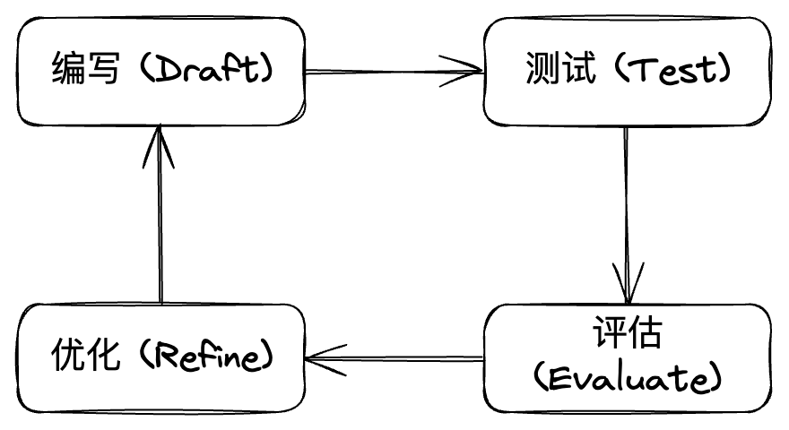
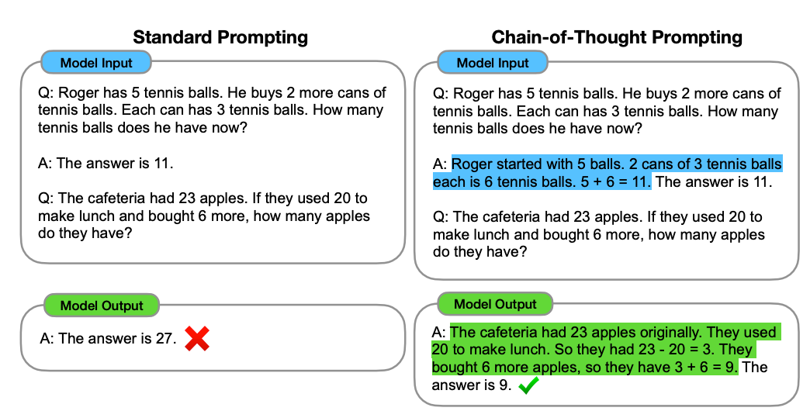
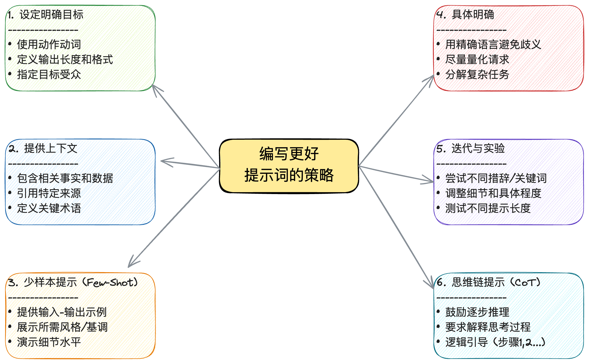

# 提示词工程（Prompt Engineering）概述

在人工智能快速发展的今天，我们见证了大型语言模型（LLM）如何改变我们与技术交互的方式。从 ChatGPT 到 Claude，这些模型展现出了令人惊叹的能力，但你是否曾想过，为什么同样的模型在不同的人手中会产生截然不同的结果？答案往往隐藏在一个看似简单却至关重要的技能中：**提示词工程（Prompt Engineering）**。

提示词工程，这个看似新兴却日益重要的领域，本质上是一门 **设计有效提示词（Prompt）** 的艺术。它不仅仅是向 AI 提出问题，更是通过精心构建的指令，引导模型理解我们的真实意图，遵循我们的期望，并生成我们真正需要的输出。随着 AI 技术渗透到各行各业——从内容创作到代码生成，从数据分析到客户服务——掌握提示词工程已成为确保 AI 交互准确性、相关性和安全性的关键所在。

---

## 目录

- [什么是提示词工程？](#什么是提示词工程)
- [什么是 AI 提示词（Prompt）？](#什么是-ai-提示词prompt)
- [提示词工程的关键要素](#提示词工程的关键要素)
- [常见提示词类型](#常见提示词类型)
- [场景及案例示例](#场景及案例示例)
- [编写更好提示词的策略](#编写更好提示词的策略)
- [提示词工程的好处](#提示词工程的好处)
- [更多提示词技术](#更多提示词技术)
- [提示词工程的未来](#提示词工程的未来)

---

## 什么是提示词工程？

那么，什么是提示词工程呢？

简单来说，它是 **设计和优化提示词（Prompt）** 的艺术与科学。

为什么称之为“工程”？来自 Anthropic 团队的观点认为，“工程”一词包含了两个核心过程：

- **试错与迭代**  
  就像编写代码一样，你拥有一个“重置按钮”。通过不断尝试、观察模型反馈、重置对话并修正指令，逐步找到最优解的过程，这就是工程化的体现。
  

- **系统思维**  
  在更复杂的应用中，提示词不仅仅是一句话，更像是“自然语言编写的代码”。此时，你需要考虑数据来源、上下文窗口限制，以及如何将提示词集成到整个系统架构中。

想象一下，与一位博学的助手对话时，提问的方式常常决定了你获得的答案。提示词工程正是如此——它通过精心构建的提示词，为 AI 模型提供必要的上下文、清晰的指令和具体的示例，帮助模型准确理解你的真实意图，并生成你真正需要的回应。

---

## 什么是 AI 提示词（Prompt）？

在AI语境中，**提示词（Prompt）** 是提供给模型以引出特定响应的输入。它形式多样，可为：

- 简单问题或关键词
- 复杂指令
- 代码片段
- 创意写作样本等

提示词的有效性直接影响 AI 输出的质量和相关性。

---

## 提示词工程的关键要素

高效的提示词工程应关注以下关键要素：

### 1. 提示词格式

提示词的结构和表达方式直接影响 AI 的响应质量。针对不同模型，常见的高效格式包括：

- 自然语言提问
- 明确的命令
- 结构化输入（如含特定字段的模板）

理解目标模型的能力与行为偏好，有助于撰写更具针对性的优质提示。

### 2. 上下文与示例

在提示词中**补充足够的上下文及示例**，可以帮助 AI 精确理解任务，生成更准确且高度相关的结果。

*例如，明确基调或话题的描述，能显著提升创意类输出的质量。*

### 3. 微调与适应

针对特定任务或行业定制提示词，有效提升模型表现。根据实际效果不断调优和完善提示，来持续优化输出质量。

### 4. 多轮对话设计

设计支持多轮对话的提示词，让用户能够与 AI 进行**连贯且具上下文记忆**的交流，从而全面提升交互体验。

---

## 常见提示词类型

AI 常用提示词类型及用途如下：

### 1. [直接提示（零样本 / Zero-shot）](https://www.promptingguide.ai/techniques/zeroshot)
无需额外上下文/示例，直接下达指令或提问。

**示例：**

- 创意生成
- 摘要/翻译

### 2. [单样本、少样本、多样本提示（One-/Few-/Multi-shot Prompts）](https://www.promptingguide.ai/techniques/fewshot)
在实际提示前，提供一个或多个“输入-输出”示例，帮助模型理解任务。

### 3. [思维链提示（Chain of Thought Prompts, CoT）](https://www.promptingguide.ai/techniques/cot)
鼓励模型将复杂推理分解为一系列中间步骤，使结果结构化、条理更清晰。

### 4. 零样本思维链（Zero-shot CoT Prompts）

结合思维链与零样本，直接要求模型分步推理，提升输出质量。

---

## 场景及案例示例

### 1. 语言和文本生成

| 场景       | 指令或提示词示例                                                                                                   |
|------------|------------------------------------------------------------------------------------------------------------------|
| 创意写作   | 写一个短篇故事，讲述一位年轻女性在她阁楼里发现了一个魔法传送门。                                                   |
| 摘要/总结  | 总结以下关于气候变化的新闻文章要点。                                                                              |
| 翻译       | 将以下文本从英语翻译为西班牙语：`The quick brown fox jumps over the lazy dog.`                                     |
| 对话设计   | 假设你是一个友好的聊天机器人，帮助用户解决电脑问题。请回复用户提出的"我的电脑开不了机"。                         |

### 2. 问答场景

| 场景           | 指令或提示词示例                                                                                                   |
|----------------|------------------------------------------------------------------------------------------------------------------|
| 开放式问题     | 解释量子计算的概念及其对未来技术的潜在影响。                                                                       |
| 具体问题设计   | 法国的首都是哪里？或：根据提供的文本，森林砍伐的主要原因是什么？                                                   |
| 多项选择题     | 谁写了《哈利·波特》系列？A) J.R.R. 托尔金, B) J.K. 罗琳, C) 斯蒂芬·金                                              |
| 假设性问题     | 如果人类能以光速旅行，会发生什么？                                                                               |
| 基于观点的问题 | 你认为人工智能最终会超越人类智能吗？为什么或为什么不？                                                               |

### 3. 代码生成场景

| 场景     | 指令或提示词示例                                                                                 |
|----------|--------------------------------------------------------------------------------------------------|
| 代码补全 | 编写一个 Python 函数来计算给定数字的阶乘。                                                        |
| 代码翻译 | 将以下 Python 代码翻译成 JavaScript：`def greet(name): print('Hello,', name)`                  |
| 代码优化 | 优化以下 Python 代码以减少其执行时间。                                                            |
| 代码调试 | 调试以下 Java 代码并解释为什么它会抛出 NullPointerException。                                    |

### 4. 图像生成场景

| 场景           | 指令或提示词示例                                                      |
|----------------|-----------------------------------------------------------------------|
| 照片级写实图像 | 一张日落时分海面上空的写实照片，棕榈树的剪影映衬着天空。             |
| 艺术图像       | 一幅印象派画作，描绘繁华的城市街道，人们在雨中撑着伞行走。            |
| 抽象图像       | 一张代表希望概念的抽象图像，使用明亮的颜色和流动的形状。               |
| 图像编辑       | 将这张照片的背景更改为星空，并添加一轮满月。或：从这张图片中移除那个人，并将其替换为一只猫。 |

---

## 编写更好提示词的策略

开发高效提示词，建议采用以下方法：

### 1. 设定明确目标和目的

- **使用动作动词指定动作**  
  示例：
  > 写一个项目符号列表，总结所附研究论文的主要发现。

- **定义输出长度和格式**  
  示例：
  > 撰写一篇 500 字的文章，讨论气候变化对沿海社区的影响。

- **指定目标受众**  
  示例：
  > 为新有机护肤产品撰写产品描述，目标受众是关注可持续发展的年轻人。

### 2. 提供上下文和背景

- **包含相关事实和数据**  
  示例：
  > 鉴于自前工业化时代以来全球气温已上升 1 摄氏度，讨论海平面上升的潜在后果。

- **引用特定来源**  
  示例：
  > 基于所附财务报告，分析公司过去五年的盈利能力。

- **定义关键术语和概念**  
  示例：
  > 用通俗易懂的语言解释量子计算概念，适合非技术受众。

---

**提示建议：**

请不要仅依赖“你是一个专家”之类的角色设定。可以把 AI 想象成一位非常聪明、能干但对你公司一无所知的临时工——他刚走进你的办公室，既不了解你的项目背景，也不懂你的行业术语。

你需要做的是，将所有背景信息、任务目标，甚至那些你觉得“旁枝末节”的边缘情况，都明确、详细地告诉他。

**专家建议：**  
与其让模型“假装你是小学老师”，不如直接说：“请用通俗易懂、适合初学者的语言解释这个概念。”

### 3. 使用少样本提示（Few-Shot Prompting）

- **提供输入-输出示例**  
  示例：
  > 输入："猫" 输出："一种有胡须的小型毛茸茸的哺乳动物。"  
  > 输入："狗" 输出："一种以忠诚著称的家养犬科动物。"  
  > 提示："大象"

- **展示所需风格/基调**  
  示例（幽默）：
  > 这位政治家的演讲太枯燥了，简直能治愈失眠。  
  示例（正式）：
  > 这位政要发表了一场既丰富又引人入胜的演说。  
  > 提示：写一个句子描述这位喜剧演员的单口相声表演。

- **细节水平演示**  
  示例（简短）：
  > 这部电影讲的是一个小男孩和一个外星人成为朋友的故事。  
  示例（详细）：
  > 这部科幻电影讲述艾略特的故事，他是一个孤独的男孩，发现了一个被困在地球上的外星人，并与它建立独特纽带。  
  > 提示：总结你刚读完的小说的情节。

### 4. 具体明确

- **用精确语言避免歧义**  
  不要用：  
  > 写一些关于气候变化的东西  
  而用：  
  > 写一篇有说服力的文章，论证实施更严格碳排放法规的必要性。

- **尽量量化请求**  
  不要用：  
  > 写一首长诗  
  而用：  
  > 写一首 14 行的十四行诗，探讨爱与失去的主题。

- **分解复杂任务**  
  不要用：  
  > 制定一个营销计划  
  而用：  
  1. 确定目标受众  
  2. 开发关键营销信息  
  3. 选择合适的营销渠道

#### 外化你的大脑 (Externalize Your Brain)

提示词工程的核心本质是将你大脑中的思维外化。正如 Anthropic 的微调团队负责人 Amanda 所述，你需要像给一个"受过良好教育的外行"写说明书一样：

- 不要假设模型懂你的"言外之意"。
- 如果你有一个复杂的概念，不要试图简化给模型看（不要"哄小孩"），直接把相关的技术文档或论文喂给它。现在的模型足够聪明，能理解高深的内容。

### 5. 迭代与实验

- **尝试不同措辞和关键词**  
  示例：
  > 用同义词或换种句式重写提示词

- **调整细节和具体程度**  
  示例：
  > 增删信息微调输出

- **测试不同提示长度**  
  示例：
  > 尝试短与长提示，找出最佳平衡

#### 像调试代码一样阅读输出

- 哪怕你写了"请逐步思考"，也要仔细检查模型是否真的在这样做。
- **寻找边缘情况 (Edge Cases)**：不要只看它处理正常请求的表现。试着给它空白数据、乱码、或者完全不相关的指令，看看它会怎么反应。
- **给模型留退路**：在提示词中明确告诉模型："如果你对这个输入不确定，请直接回答'我不确定'，不要编造。"这能显著减少幻觉。

### 6. 利用思维链提示（Chain of Thought Prompting）

- **鼓励逐步推理**  
  示例：
  > 逐步解决这个问题：约翰有 5 个苹果，他吃了 2 个。他还剩几个苹果？  
  1. 约翰开始有 5 个苹果  
  2. 他吃了 2 个苹果，5 - 2 = 3  
  3. 答案：约翰还剩 3 个苹果

- **要求模型解释推理过程**  
  示例：
  > 解释你在确定这条电影评论的情感时的思考过程：'演技精湛，但情节是可以预测的。'

- **通过逻辑步骤引导模型**  
  示例：
  > 要将此电子邮件分类为垃圾邮件或非垃圾邮件，请考虑以下几点：  
  1. 发件人是否已知？  
  2. 主题行是否包含可疑关键字？  
  3. 邮件优惠是否过于夸张？

### 7. 反向利用模型

#### 让 AI 采访你

有时候写提示词最难的是不知道自己遗漏了什么信息。你可以要求 AI 反过来采访你：
> 我想让你帮我完成这个任务，你需要我提供哪些信息？请向我提问。

---

## 提示词工程的好处

- **提升模型性能**  
  清晰说明与上下文，使 AI 模型输出更准确、相关、信息丰富。

- **减少偏见和有害响应**  
  通过控制输入与关注点，减轻偏见，最大限度降低不当内容生成风险。

- **增加可控性和可预测性**  
  可影响和稳定 AI 行为，确保响应持续可靠，符合预期。

- **增强用户体验**  
  清晰简洁的提示词使交互便捷，体验更直观、更令人满意。

---

## 提示词工程的未来

### 从"指令"到"引导"

随着模型变得越来越智能，未来的提示词工程可能不再是绞尽脑汁编写复杂的指令，而是更多地变成一种引导（Elicitation）。

未来的交互模式可能是：你提出模糊的需求，模型通过“采访”你来理清思路，最终由模型自己构建出完美的执行方案。

正如设计领域一样，AI 将从一个被动的执行者，变成一个主动帮你理清需求的设计师。

## 更多提示词技术

1. [Meta Prompting（元提示）](https://www.promptingguide.ai/techniques/meta-prompting)  
这是一种“结构导向”的技术。它不关注具体内容细节，而是通过提供抽象的句法结构或模板，引导模型理解任务的底层模式。  
核心逻辑：指示模型以高维度的视角（如类型理论）审视问题，关注“如何思考”而非“思考什么”。

2. [Self-Consistency（自洽性）](https://www.promptingguide.ai/techniques/consistency)  
针对复杂推理任务（如数学题），简单的思维链可能会走进死胡同。自洽性技术通过让模型生成多条不同的推理路径，然后统计最常出现的答案。  
核心逻辑：利用“少数服从多数”的原理，从多个推理结果中选择一致性最高的那个，以提高准确率。

3. [Generated Knowledge Prompting（生成知识提示）](https://www.promptingguide.ai/techniques/knowledge)  
模型有时会因为缺乏上下文而回答错误。这项技术要求模型在回答问题前，先“回忆”或生成相关的背景知识。  
核心逻辑：先生成知识，再整合推理。即：生成知识 -> 将知识作为上下文 -> 回答问题。

4. [Prompt Chaining（提示链）](https://www.promptingguide.ai/techniques/prompt_chaining)  
将一个庞大复杂的任务拆解为一系列子任务。上一个提示的输出可直接作为下一个提示的输入。  
核心逻辑：分而治之。这不仅提高了长任务的可靠性，还增加了系统的透明度，便于调试每一环节。

5. [Tree of Thoughts (ToT, 思维树)](https://www.promptingguide.ai/techniques/tot)  
传统的思维链是一条路走到底，而 ToT 允许模型像下棋一样探索。它构建一个“思维树”，并在推理过程中进行前瞻、评估和回溯。  
核心逻辑：结合搜索算法（如广度优先搜索 BFS），在每一步评估多个可能的解决方案，保留最佳路径，摒弃错误路径。

6. [Retrieval Augmented Generation (RAG, 检索增强生成)](https://www.promptingguide.ai/techniques/rag)  
为了解决大模型知识过时或“幻觉”问题，RAG 为模型外挂了一个“知识库”。  
核心逻辑：检索 -> 增强 -> 生成。模型先从外部（如维基百科、企业文档）检索相关信息，将其作为上下文，再生成基于事实的回答。

7. [Automatic Reasoning and Tool-use (ART)](https://www.promptingguide.ai/techniques/art)  
这是一种自动化框架，旨在让冻结参数的大模型也能像人类一样使用工具。  
核心逻辑：系统会自动在“推理步骤”和“工具调用”之间交替。当推理需要外部数据时，自动暂停生成，调用工具（如计算器、搜索 API），将结果填回后再继续生成。

8. [Automatic Prompt Engineer (APE)](https://www.promptingguide.ai/techniques/ape)  
把“写提示词”这件事本身变成一个优化问题。  
核心逻辑：利用 AI 生成指令候选集，通过测试打分，自动筛选出效果最好的提示词。例如，APE 发现 "Let's work this out in a step by step way..." 比传统人类提示词的效果更好。

9. [Active-Prompt（主动提示）](https://www.promptingguide.ai/techniques/activeprompt)  
传统的思维链示例是固定的，而 Active-Prompt 更加动态。  
核心逻辑：计算模型在回答问题时的“不确定性”，主动筛选出那些模型最困惑的难题，让人类专家针对性地编写思维链示例，从而高效提升模型表现。

10. [Directional Stimulus Prompting（定向刺激提示）](https://www.promptingguide.ai/techniques/dsp)  
使用一个较小的辅助模型（策略模型）来引导大模型。  
核心逻辑：辅助模型分析输入并生成特定的“关键词”或“线索”（Stimulus），这些线索作为提示的一部分，引导大模型生成符合特定风格或倾向的摘要或回答。

11. [Program-Aided Language Models (PAL, 程序辅助)](https://www.promptingguide.ai/techniques/pal)  
对于数学计算或逻辑问题，LLM 容易出错。PAL 让模型不直接写答案，而是写代码。  
核心逻辑：将推理过程“外包”给 Python 解释器。模型生成解决问题的代码，通过运行代码得到绝对精确的结果。

12. [ReAct Prompting（推理+行动）](https://www.promptingguide.ai/techniques/react)  
结合了推理（Reasoning）和行动（Acting）。  
核心逻辑：模型在一个循环中工作——先思考当前情况，决定采取行动（如查询 API），观察行动结果，再进行下一步思考。这比单纯的工具调用更具逻辑规划能力。

13. [Reflexion（反思）](https://www.promptingguide.ai/techniques/reflexion)  
赋予模型“自我纠错”的能力。  
核心逻辑：当任务失败时，模型不仅接收错误信号，还会生成一段“语言反馈”（自我反思），分析哪里做错了。这些反思会被存入记忆，在下一次尝试中作为参考，避免重蹈覆辙。

14. [Multimodal CoT（多模态思维链）](https://www.promptingguide.ai/techniques/multimodalcot)  
将思维链技术从纯文本扩展到“视觉+文本”领域。  
核心逻辑：模型分两步走：先基于图像和文本输入生成“理由（Rationale）”，再基于理由推断答案。这在处理科学问答或图表分析时效果显著。

15. [Graph Prompting（图提示）](https://www.promptingguide.ai/techniques/graph)  
专门针对图数据（如图神经网络）的提示技术。  
核心逻辑：帮助模型理解复杂的图结构（如社交网络、分子结构），利用提示词检索相关的实体关系，解决知识图谱类下游任务。

---

## 参考来源

- [Google Cloud - Prompt engineering: overview and guide](https://cloud.google.com/discover/what-is-prompt-engineering#what-is-prompt-engineering)
- [Prompting Guide](https://www.promptingguide.ai/)
- [AI prompt engineering: A deep dive (YouTube)](https://www.youtube.com/watch?v=T9aRN5JkmL8)